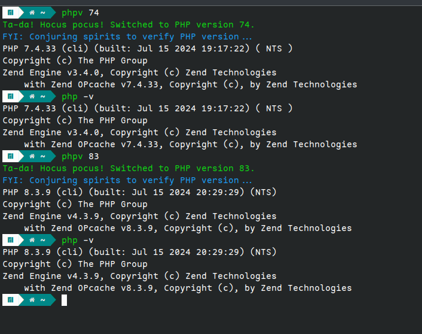

## PHP Version Management Made Fun: Conquering PHP with PHPV on Arch Linux (and Avoiding Hilarious Developer Mishaps)

### Introduction

Greetings, fellow coders! Struggling to manage PHP versions on your Arch Linux system (like Manjaro, EndeavourOS, Garuda Linux, and ArcoLinux)? Wish switching PHP versions wasn't a labyrinthine adventure? Fear not, for PHPV has arrived to simplify your PHP life, with a touch of programmer humor on the side.

### Installation Guide

#### Downloading PHPV

Embrace the command line for a quick and efficient installation:

```bash
curl -sSL https://raw.githubusercontent.com/Its-Satyajit/phpv/main/install.sh | bash
```

#### Manual Installation (Optional)

For the adventurous, here's the manual route:

1. **Clone the Repository:**

    ```bash
    git clone https://github.com/Its-Satyajit/phpv.git
    ```

2. **Navigate and Grant Permissions:**

    ```bash
    cd phpv
    chmod +x phpv
    ```

3. **Install PHPV:**

    ```bash
    mv phpv $HOME/bin/phpv
    ```

4. **Update Shell Configuration:**

    Add this line to your shell configuration file (e.g., ~/.bashrc, ~/.bash_profile):

    ```bash
    export PATH="$HOME/bin:$PATH"
    ```

5. **Refresh Terminal:**

    ```bash
    source ~/.bashrc  # Replace with your appropriate shell command
    ```

### Uses

#### Installing/Updating/Reinstall PHP Versions

Need the latest PHP version or just a change of pace? PHPV can help:

```bash
phpv -i <version>
```

Replace `<version>` with the desired shorthand (e.g., 80 for 8.0, 74 for 7.4). Remember, with great PHP power comes the responsibility to write clean, bug-free code.

**Install**


**Update/Reinstall**


#### Switching PHP Versions

Switching versions is a breeze:

```bash
phpv <version>
```

Pick your weapon (version shorthand), and PHPV handles the rest. Debugging should be an adventure, not a nightmare.

**Switch**



### Troubleshooting

**Having trouble with the c-client dependency? This section outlines the manual installation steps. If you're new to compiling, consider the pre-built binary or seeking help online.**

#### Pre-built Binary for Easy Resolution

Why waste time compiling? Download the pre-built c-client binary directly from PHPV:

-   c-client-2007f-20-x86_64.pkg.tar.zst

This is the recommended approach for most users, saving you time and compilation headaches.

**Verification (Optional):**

Downloaded the binary but have doubts? Verify its integrity using these hash values:

-   MD5: 96d92a8b98afd78d2f2c80f8b0d76473
-   SHA1: 4451582984bf02b1b78425b75100ca20018c8557
-   SHA256: c6c9a0a411f476be1357f5aad8db897ce4d47f3f78757acd2aade3e477e2fe4d
-   SHA512: 9628031b0f0efe4024c515f0a882418d7665b3267644f3bf0f12adbc5f200a9cca3049ab218be176ae8562673edca46190ca44de1154a32e0bf828028470ef1e

For additional peace of mind, use VirusTotal for verification.

#### Manual Compilation (Advanced Users Only)

**Disclaimer:** Manual compilation can introduce conflicts with existing system packages. It's generally recommended using the pre-built binary or your system's package manager (e.g., pacman) for a safer and more reliable installation. If you're comfortable with the risks and possess advanced Linux knowledge, proceed with caution. Consider consulting online resources or the Arch Linux forums for help if needed.

**For Users Comfortable with Manual Compilation**

Here's a step-by-step guide for those who prefer manual compilation:

1. **Gather Your Tools:**

    Ensure you have the necessary development tools installed on your Arch Linux system. You'll typically need:

    - `make`: A tool for automating compilation tasks.
    - A C compiler: Most commonly `gcc` is used for compiling C code.
    - Development headers for system libraries: These provide header files needed for compilation. These are usually installed with the `pacman -S base-devel` command.

2. **Download the Source Code:**

    Access the official c-client source code repository: [https://gitweb.gentoo.org/repo/gentoo.git/tree/](https://gitweb.gentoo.org/repo/gentoo.git/tree/) (May the source be with you!)

3. **Unpack the Source:**

    Extract the downloaded source code archive using `tar`:

    ```bash
    tar -zxvf c-client-X.Y.Z.tar.gz
    ```

    Replace `X.Y.Z` with the specific version number you require. Pro-tip: Check online for the latest stable version to avoid potentially buggy surprises.

4. **Configure and Build (with Caution):**

    Navigate into the extracted directory:

    ```bash
    cd c-client-X.Y.Z
    ```

    Now for the "magic incantation" (compilation flags) to potentially resolve the implicit declaration of function 'safe_flock' error:

    ```bash
    CFLAGS="-Wno-error=implicit-function-declaration -Wno-error=incompatible-pointer-types" ./configure
    ```

    This tells the compiler to ignore specific warnings. However, suppressing warnings can mask underlying issues. Proceed with caution and consider investigating the cause of these warnings if possible. Think of warnings like Yoda: sometimes cryptic, but their wisdom shouldn't be ignored!

    **Alternative Compilation Flags:**

    While these flags might seem like a compiler shortcut, remember that suppressing warnings is generally not recommended. It's better to fix the root cause to ensure your code is solid.

5. **Dependency Management:**

    Before you embark on this compilation adventure, ensure you have all the necessary dependencies installed. Use `pacman` to check for missing packages. It's like checking your backpack before a coding quest – you don't want to realize you're missing essential libraries halfway through!

    Try compiling with default flags in PKGBUILT first. The error you're facing might have been fixed since this guide was written. No need to reinvent the wheel (unless you're feeling particularly creative, like writing your own operating system from scratch).

    If you encounter errors, use the flags mentioned above. Remember, Stack Overflow is always a helpful companion on your compilation journey. Think of it as the online forum where you can find the wisdom of the coding collective.

6. **Installation (with a Touch of Caution):**

    Important: Manual installation can potentially conflict with existing system packages. It's generally recommended to use the pre-built binary or your package manager for safe and reliable installation.

    If you choose to proceed, use `sudo make install` with caution:

    ```bash
    sudo make install
    ```

    This installs the compiled c-client library into your system's default library directory. Remember, with great compilation power comes great responsibility!

7. **Remember:** Manual compilation can be a complex process. If you encounter difficulties, consider consulting online resources or seeking help from the Arch Linux community forums. They're like the Jedi Council of the Linux world, always willing to guide you through the compilation labyrinth.

By following these steps and understanding the potential risks, you can manually compile the c-client library for PHPV. However, for most users, the pre-built binary or using the system's package manager is the safer and more recommended approach.
